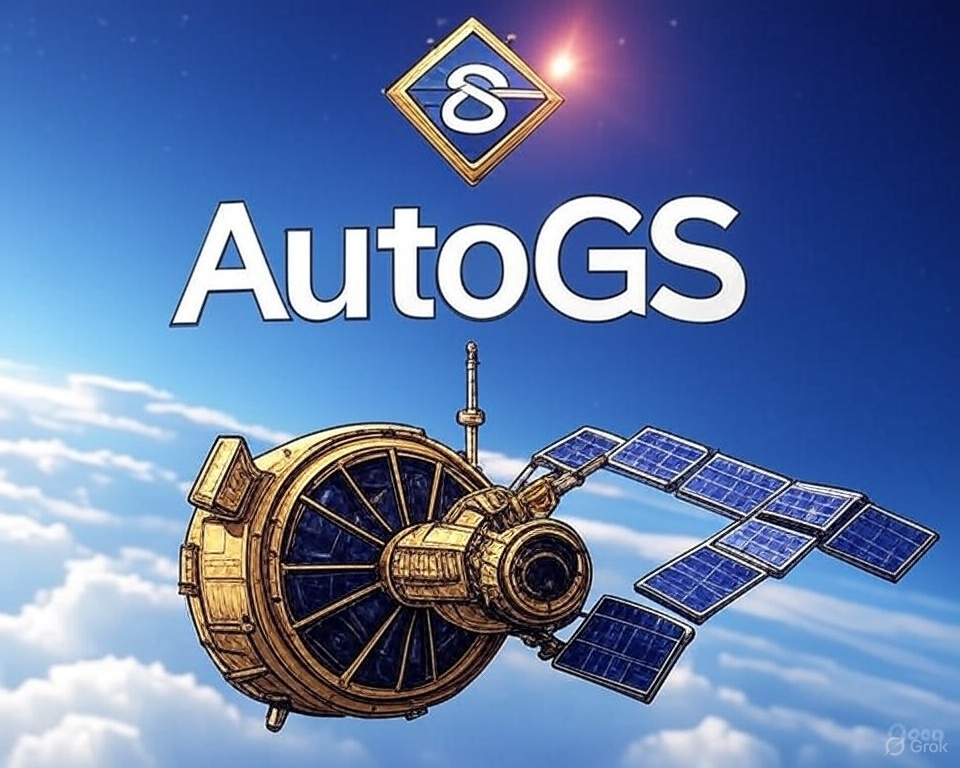

# AutoGS


# AutoGuided Onboarding WebApp for Carbon Footprint Reduction (v3.0)  
**Powered by AutoGS AI & AWS SageMaker**

---

This solution includes:
1. [Wireframe Design](#wireframe-design)  
2. [Prototype](#prototype)  
3. [Mockup Design](#mockup-design)  
4. [SageMaker AI Model Update](#sagemaker-ai-model-update)  
5. [Development Requirements](#development-requirements)  
6. [Getting Started](#getting-started)  
7. [Contribution Guidelines](#contribution-guidelines)  
8. [Code of Conduct](#code-of-conduct)  
9. [Contact](#contact)  
10. [License](#license)  
11. [Resources](#resources)  

---


## SageMaker AI Model Update

### Pipeline Overview
- **Training:** Uses SmallSat earth observation data, processed via `imagery_processing.ipynb`
- **Model Registry:** Tracks and versions trained models with full audit logs
- **Deployment:** Real-time inference through **SageMaker Endpoints** connected to the dashboard
- **AutoML Option:** Supports **H2O AutoML** for automated model selection

### Key Files
- `ml/carbon_model_sagemaker_pipeline.ipynb`: Defines the SageMaker ML pipeline  
- `ml/deploy_endpoint.py`: Deploys models to SageMaker Endpoints  
- `ml/inference_handler.py`: Handles API requests from the frontend  

### AWS Services Used
- **Amazon SageMaker**
- **AWS Ground Station**
- **Amazon S3**
- **AWS Lambda**
- **Amazon CloudWatch**

### Benefits of Migration
- Managed scalability
- Built-in versioning
- Secure infrastructure
- Reduced operational overhead

---

## Development Requirements

- **Python 3.9+**
- AWS CLI configured (IAM permissions required)
- AWS SDKs: `boto3`, `sagemaker`
- Python packages:
  - `numpy`, `pandas`, `scikit-learn`, `matplotlib`, `transformers`
  - `torch`, `tensorflow`, `gradio`, `rasterio`, `cv2`
  - `sagemaker`, `boto3`
- Optional: **Docker** (for local SageMaker testing)
- **Git client**

---

## Getting Started

1. **Clone the repository:**

```bash
git clone https://github.com/aimtyaem/autogs.git
cd autogs

2. Set up Python environment:


python -m venv venv
source venv/bin/activate  # Windows: venv\Scripts\activate
pip install -r requirements.txt

3. Configure AWS credentials:


aws configure

4. Run SageMaker pipeline notebook:

Open ml/carbon_model_sagemaker_pipeline.ipynb and execute cells.

Deploy endpoint with deploy_endpoint.py.


5. Launch frontend and connect to live AI models.


---

Contribution Guidelines


---

Code of Conduct


---

Contact

Ahmed Ibrahim Metawee


---

License

Licensed under the MIT License.


